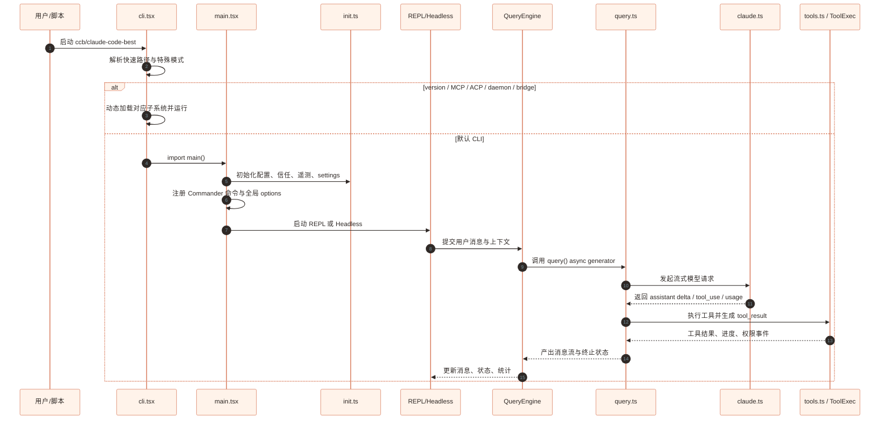

# claude-code-best 架构与设计分析

本文基于当前仓库结构、关键入口和核心模块关系整理。项目定位是一个基于 Bun/TypeScript 的终端 AI 编程助手 CLI，代码形态来自对 Claude Code CLI 的逆向恢复与工程化裁剪：保留核心交互、模型调用、工具执行、MCP、远程控制、ACP 等能力，同时用 feature flag 管控大量实验性或内部能力。

## 1. 总体架构

项目采用 Bun workspace 组织，主应用在 `src/`，可复用能力沉淀在 `packages/`。运行时以 CLI 为入口，既支持交互式 REPL，也支持 pipe/headless、MCP server、ACP agent、daemon、remote-control 等多种模式。

```mermaid
%%{init: {"theme":"base", "themeVariables": {"background":"#fffaf5", "primaryColor":"#fff3ea", "primaryTextColor":"#2f2926", "primaryBorderColor":"#d77757", "lineColor":"#8b6f63", "secondaryColor":"#eef2ff", "tertiaryColor":"#f6f1eb", "clusterBkg":"#fffaf5", "clusterBorder":"#ead8cd", "fontFamily":"Inter, ui-sans-serif, system-ui"}}}%%
flowchart TB
  classDef entry fill:#fff3ea,stroke:#d77757,color:#2f2926,stroke-width:1.4px;
  classDef core fill:#f8f1ec,stroke:#b98a75,color:#2f2926;
  classDef ui fill:#eef2ff,stroke:#5769f7,color:#20233a;
  classDef tool fill:#f3f7ef,stroke:#7a9b61,color:#26311f;
  classDef api fill:#fff8dc,stroke:#c99a2e,color:#332a12;
  classDef remote fill:#eef8f6,stroke:#4c9a8a,color:#1d332f;
  classDef pkg fill:#f7f7f7,stroke:#aaa,color:#2f2f2f;

  User[用户 / 自动化脚本]:::entry --> CLI[src/entrypoints/cli.tsx<br/>轻量启动器与快速路径]:::entry
  CLI --> Main[src/main.tsx<br/>Commander 命令树与会话启动]:::core
  Main --> Init[src/entrypoints/init.ts<br/>配置、遥测、信任与初始化]:::core
  Main --> REPL[src/screens/REPL.tsx<br/>交互式终端界面]:::ui
  Main --> Headless[Headless / Pipe / SDK 路径]:::core
  Main --> ModeSwitch{特殊运行模式}:::entry

  REPL --> AppState[src/state/*<br/>全局会话状态与 selector store]:::ui
  REPL --> QueryEngine[src/QueryEngine.ts<br/>会话编排、消息状态、压缩、归因]:::core
  Headless --> QueryEngine
  QueryEngine --> Query[src/query.ts<br/>主 turn loop / async generator]:::core
  Query --> ToolExec[src/services/tools/*<br/>工具调度、权限、流式工具执行]:::tool
  Query --> API[src/services/api/claude.ts<br/>请求构建、流式事件处理、usage/cost]:::api

  ToolExec --> ToolRegistry[src/tools.ts + src/Tool.ts<br/>工具接口与注册表]:::tool
  ToolRegistry --> Builtin[packages/builtin-tools<br/>文件、Shell、Agent、Web、MCP、任务工具]:::pkg
  ToolExec --> MCP[src/services/mcp + packages/mcp-client<br/>外部 MCP 工具与资源]:::remote

  API --> Provider{Provider 选择}:::api
  Provider --> FirstParty[Anthropic First-party]:::api
  Provider --> Bedrock[AWS Bedrock]:::api
  Provider --> Vertex[Google Vertex]:::api
  Provider --> Foundry[Foundry]:::api
  Provider --> OpenAI[src/services/api/openai<br/>OpenAI-compatible 适配器]:::api
  Provider --> Gemini[src/services/api/gemini<br/>Gemini 适配器]:::api
  Provider --> Grok[src/services/api/grok<br/>Grok 适配器]:::api

  ModeSwitch --> Bridge[src/bridge<br/>Remote Control / Bridge]:::remote
  ModeSwitch --> ACP[src/services/acp + packages/acp-link<br/>Agent Client Protocol]:::remote
  ModeSwitch --> Daemon[src/daemon<br/>常驻 supervisor / worker]:::remote
  ModeSwitch --> ComputerUse[packages/@ant/computer-use-*<br/>截图、键鼠、系统集成]:::pkg
  ModeSwitch --> ChromeMcp[packages/@ant/claude-for-chrome-mcp<br/>Chrome 控制 MCP]:::pkg
  Bridge --> RCS[packages/remote-control-server<br/>自托管 RCS + React Web UI]:::remote
  Build[build.ts / scripts/defines.ts<br/>Bun build、宏注入、feature flags、Node 兼容产物]:::core -.产物.-> CLI
```

整体可以理解为五层：

1. **启动与模式分发层**：`cli.tsx` 负责快速路径和特殊模式，尽量避免无谓模块加载。
2. **会话与 UI 层**：`main.tsx` 建立命令树和运行上下文，REPL 使用 React/Ink 渲染终端界面，`AppState` 管理会话状态。
3. **查询编排层**：`QueryEngine` 维护对话、文件历史、压缩、归因、错误恢复等；`query.ts` 执行模型 turn loop。
4. **工具与权限层**：工具统一实现 `Tool` 接口，由 `tools.ts` 根据 feature flag、环境变量、MCP 连接和运行模式拼装。
5. **模型与协议适配层**：`claude.ts` 是统一模型调用边界，向下分发到 Anthropic、Bedrock、Vertex、OpenAI-compatible、Gemini、Grok 等 provider。

## 2. 目录结构与组件职责

| 路径 | 角色 | 关键职责 |
| --- | --- | --- |
| `src/entrypoints/cli.tsx` | 真正入口 | 处理 `--version`、MCP、ACP、daemon、remote-control 等快速路径；通过动态 import 降低启动成本。 |
| `src/main.tsx` | CLI 主程序 | Commander 命令树、配置加载、权限模式、MCP/插件初始化、REPL/Headless 分发。 |
| `src/entrypoints/init.ts` | 初始化 | 一次性配置、遥测、信任判断和启动前置逻辑。 |
| `src/screens/REPL.tsx` | 交互 UI | 终端输入、消息显示、工具权限提示、快捷键、REPL 状态展示。 |
| `src/components/` | Ink 组件 | 消息列表、PromptInput、权限对话框、设计系统组件等。 |
| `packages/@ant/ink/` | 自定义 Ink 框架 | React terminal renderer 的组件、hooks、keybindings、theme。 |
| `src/state/*` | 会话状态 | `AppState` 类型、store、selector、状态变更监听；降低 React 重渲染成本。 |
| `src/QueryEngine.ts` | 查询编排器 | 连接 UI/Headless 和底层 `query()`；维护消息、压缩、重试、文件历史、归因和插件上下文。 |
| `src/query.ts` | 主循环 | 模型流式输出、tool_use/tool_result 编排、token budget、compact、stop hooks、错误恢复。 |
| `src/services/api/claude.ts` | API 边界 | 构建 system prompt/messages/tools/betas，处理流式事件，统计 usage/cost，分发多 provider。 |
| `src/utils/model/providers.ts` | Provider 选择 | 按 `modelType` 与环境变量选择 `firstParty/bedrock/vertex/foundry/openai/gemini/grok`。 |
| `src/Tool.ts` | 工具抽象 | 定义 Tool 接口、权限上下文、工具执行上下文、工具匹配逻辑。 |
| `src/tools.ts` | 工具注册表 | 汇总内置工具、MCP 工具、实验工具、环境专属工具；按 feature flag 条件加载。 |
| `packages/builtin-tools/` | 内置工具包 | 文件读写编辑、Bash/PowerShell、Glob/Grep、Agent、Task、Web、MCP、计划模式等。 |
| `src/services/mcp/` / `packages/mcp-client/` | MCP 客户端 | 外部 MCP server 连接、工具/资源发现、鉴权与 elicitation。 |
| `src/bridge/` | Remote Control | 本地 CLI 与远程控制服务之间的会话、权限回调、消息传输和调度。 |
| `packages/remote-control-server/` | 自托管 RCS | WebSocket/SSE/REST 后端与 React Web UI，支持远程会话控制和 ACP 接入。 |
| `src/services/acp/` / `packages/acp-link/` | ACP | 实现 Agent Client Protocol agent 与代理服务，支持外部客户端接入 CLI 能力。 |
| `src/daemon/` | Daemon | 长驻 supervisor 和 worker registry，用于后台会话或远程 assistant worker。 |
| `build.ts` / `scripts/defines.ts` | 构建系统 | Bun build、宏注入、feature 默认列表、Node 兼容后处理、vendor/native 文件复制。 |
| `tests/` 与 `src/**/__tests__/` | 测试 | Bun test 单元/集成测试，重点覆盖 API、MCP、Bridge、ACP、工具链等。 |

## 3. 启动流程设计

`src/entrypoints/cli.tsx` 是一个轻量 bootstrap，而不是直接加载全部 CLI。它先处理成本最低、最常用或独立性强的路径：

- `--version` 直接输出版本，几乎零额外模块加载。
- `--dump-system-prompt`、Chrome MCP、Computer Use MCP、ACP、daemon worker、remote-control、后台会话命令等先被拦截。
- 默认路径再动态 import `src/main.tsx`，加载完整 Commander 命令树。

这种设计的核心收益是：**常见快速命令响应快，特殊 server/worker 模式可以保持依赖边界清晰，完整 CLI 的重依赖只在必要时加载**。



## 4. 查询与工具执行链路

核心交互不是一次简单的 LLM 请求，而是一个可暂停、可重试、可调用工具的异步状态机。

```mermaid
%%{init: {"theme":"base", "themeVariables": {"background":"#fffaf5", "primaryColor":"#fff3ea", "primaryTextColor":"#2f2926", "primaryBorderColor":"#d77757", "lineColor":"#8b6f63", "secondaryColor":"#eef2ff", "tertiaryColor":"#f3f7ef", "fontFamily":"Inter, ui-sans-serif, system-ui"}}}%%
flowchart LR
  classDef state fill:#eef2ff,stroke:#5769f7,color:#20233a;
  classDef action fill:#fff3ea,stroke:#d77757,color:#2f2926;
  classDef guard fill:#fff8dc,stroke:#c99a2e,color:#332a12;
  classDef tool fill:#f3f7ef,stroke:#7a9b61,color:#26311f;

  A[用户输入 / 恢复会话]:::state --> B[QueryEngine<br/>整理 messages、system prompt、工具列表]:::action
  B --> C[query.ts<br/>构建 turn 配置与预算]:::action
  C --> D{上下文是否过长?}:::guard
  D -- 是 --> E[compact / microcompact / history snip]:::action
  D -- 否 --> F[claude.ts<br/>调用 provider 流式 API]:::action
  E --> F
  F --> G{流中出现 tool_use?}:::guard
  G -- 否 --> H[输出最终 AssistantMessage]:::state
  G -- 是 --> I[StreamingToolExecutor / runTools]:::tool
  I --> J{权限是否允许?}:::guard
  J -- ask/deny --> K[REPL 权限 UI 或自动拒绝]:::state
  J -- allow --> L[执行 Bash/File/MCP/Agent/Web 等工具]:::tool
  K --> M[生成 tool_result 或 denial result]:::tool
  L --> M
  M --> N[追加 tool_result 到消息历史]:::action
  N --> C
  H --> O[stop hooks、usage/cost、归因、文件历史]:::action
```



关键点：`QueryEngine` 是会话控制器，负责把 UI、插件、MCP、配置、消息历史整理成一次 query 所需上下文；`query.ts` 是 turn 状态机，调度流式响应、工具调用、compact、错误恢复、token budget 和 stop hooks；`claude.ts` 是模型协议边界，把内部消息/工具格式转换成 provider 请求，再把 provider 流式事件还原成内部消息。工具执行和模型流可以部分并发，权限上下文则贯穿工具执行全过程。

## 5. Provider 兼容层

Provider 选择由 `src/utils/model/providers.ts` 统一处理，优先级是：

1. settings 中的 `modelType`。
2. 环境变量，如 `CLAUDE_CODE_USE_BEDROCK`、`CLAUDE_CODE_USE_OPENAI`、`CLAUDE_CODE_USE_GEMINI`。
3. 默认 `firstParty`。

`src/services/api/claude.ts` 保持了“内部 Anthropic 消息模型”作为核心中间表示。OpenAI、Gemini、Grok 等兼容层通过适配器把第三方 chat/completions 或模型流转换回内部事件，避免上层 `query.ts`、`QueryEngine`、UI 和工具系统感知 provider 差异。

```mermaid
%%{init: {"theme":"base", "themeVariables": {"background":"#fffaf5", "primaryColor":"#fff3ea", "primaryTextColor":"#2f2926", "primaryBorderColor":"#d77757", "lineColor":"#8b6f63", "secondaryColor":"#eef2ff", "tertiaryColor":"#fff8dc", "fontFamily":"Inter, ui-sans-serif, system-ui"}}}%%
flowchart TB
  Internal[内部消息模型<br/>Message + Tool + SystemPrompt] --> ClaudeAPI[src/services/api/claude.ts]
  ClaudeAPI --> Select{getAPIProvider()}
  Select --> FP[First-party Anthropic SDK]
  Select --> BR[Bedrock Adapter]
  Select --> VX[Vertex Adapter]
  Select --> FD[Foundry Adapter]
  Select --> OA[OpenAI-compatible Adapter]
  Select --> GM[Gemini Adapter]
  Select --> GK[Grok Adapter]
  FP --> Stream[统一流式事件<br/>assistant delta / tool_use / usage]
  BR --> Stream
  VX --> Stream
  FD --> Stream
  OA --> Stream
  GM --> Stream
  GK --> Stream
  Stream --> Query[query.ts 继续工具循环]
```

这个设计的优势是适配器边界清晰：新增 provider 主要影响 `services/api/<provider>` 和 provider 选择逻辑，不需要改 `query.ts` 和 UI。

## 6. 工具系统与权限模型

工具系统由两部分组成：

- `src/Tool.ts` 定义统一接口、输入 schema、权限上下文、执行上下文和 helper。
- `src/tools.ts` 负责把具体工具实例聚合成运行时可用工具列表。

工具来源包括：

- 内置工具：`packages/builtin-tools/src/tools/`，覆盖 FileRead/FileWrite/FileEdit、Bash/PowerShell、Glob/Grep、Agent、Task、WebFetch/WebSearch、MCP resource、计划模式等。
- MCP 工具：通过 MCP client 连接外部 server 后动态注入。
- 插件/技能/工作流工具：由 plugin、skill、workflow 机制扩展。
- feature-gated 工具：如 Monitor、Snip、DiscoverSkills、Workflow、RemoteTrigger 等。

权限模型的核心不是简单 allow/deny，而是把权限模式、额外工作目录、allow/deny/ask 规则、远程回调、自动化检查等统一放进 `ToolPermissionContext`。这使同一套工具可以在交互式 REPL、Headless、后台 agent、ACP、Remote Control 中复用。

## 7. 状态管理与 UI 设计

UI 使用 React + 自定义 Ink。`AppStateProvider` 创建一个外部 store，组件通过 `useSyncExternalStore` 订阅 selector，而不是把整个状态作为 React context value 传递。这是一个重要性能设计：

- store 引用稳定，Provider 本身不会因为状态变更导致整棵树重渲染。
- 组件只订阅自己需要的状态片段。
- selector 返回整个 state 会在 ant 用户下主动抛错，强制避免低效订阅。

`AppState` 覆盖范围很广，包括模型、权限、MCP、插件、任务、Agent、Bridge、Remote session、todos、文件历史、归因、prompt suggestion、speculation 等。它是 REPL 体验的单一会话状态源。

## 8. Remote Control、ACP 与多进程模式

项目不只是本地 CLI，还支持远程和外部 agent 接入：

- `src/bridge/`：本地 CLI 与远程控制服务之间的桥接层，处理环境注册、会话创建、消息传输、权限回调、结果调度和重连。
- `packages/remote-control-server/`：自托管远程控制服务，后端提供 WebSocket/SSE/REST，前端是 React + Vite + Radix UI 控制面板。
- `src/services/acp/`：ACP agent 实现，让 CLI 能以 Agent Client Protocol 对外服务。
- `packages/acp-link/`：ACP 代理服务器，负责 WebSocket 到 ACP agent 的桥接，也能与 RCS 集成。
- `src/daemon/`：长驻 supervisor/worker，用于后台任务、remote assistant 等场景。

这些模块与主 REPL 的关系是“共享能力，独立入口”：它们复用模型调用、权限、工具、消息协议，但由 `cli.tsx` 快速路径分流，避免把远程/daemon 逻辑塞进普通 REPL 启动路径。

## 9. 构建、Feature Flag 与运行时策略

构建系统围绕 Bun 设计：

- `build.ts` 使用 `Bun.build()`，入口为 `src/entrypoints/cli.tsx`，开启 code splitting。
- `scripts/defines.ts` 注入 `MACRO.VERSION`、`MACRO.BUILD_TIME` 等宏，同时维护默认启用 feature 列表。
- 构建后会把 `import.meta.require` 转为 Node 兼容写法，并保护第三方依赖中直接解构 `globalThis.Bun` 的代码。
- 产物生成 `cli-bun.js` 和 `cli-node.js` 两个 shebang 入口。
- 额外复制 native addon 与 vendored ripgrep，保证发布产物可执行。

Feature flag 的设计意图很明确：这个仓库有大量恢复中、内部化、实验性或平台相关能力，不能都作为默认路径无条件加载。标准写法是 `import { feature } from 'bun:bundle'` 后直接在 `if` 或三元条件中使用，让 Bun/构建器可以做 dead code elimination。

## 10. 设计思路总结

这个项目的核心设计思路可以概括为：

1. **以 CLI 为外壳，以异步模型工具循环为内核**：用户看到的是终端 REPL，但真正的复杂度集中在 `QueryEngine -> query -> claude.ts -> tools` 的循环。
2. **内部协议稳定，外部协议可替换**：内部保持 Anthropic 风格的 message/tool 表示，OpenAI/Gemini/Grok/MCP/ACP/Bridge 都在边界做适配。
3. **轻启动与懒加载优先**：入口层大量动态 import，快速路径不加载完整 CLI，server/worker 模式只加载自身依赖。
4. **工具是第一等扩展点**：文件、Shell、Agent、MCP、Web、计划、任务都被统一成 Tool，权限和上下文也围绕 Tool 设计。
5. **Feature flag 管控复杂度**：恢复型项目不可避免有大量能力差异，feature flag 让构建、实验、回滚和裁剪都更可控。
6. **UI 与业务状态解耦**：React/Ink 只负责展示和交互，`AppState`/store 负责会话状态，`QueryEngine` 负责业务编排。
7. **面向多运行环境**：Bun 是开发和构建主路径，但产物考虑 Node 兼容；本地 CLI、远程控制、ACP、daemon 共享核心能力。

## 11. 主要风险与工程挑战

- **反编译代码复杂度高**：`main.tsx` 和部分 React Compiler 输出代码很大，重构成本高，局部修改需要严格 typecheck。
- **feature flag 使用约束强**：`feature()` 只能直接用于 `if` 或三元条件，误用会影响 Bun 编译和 DCE。
- **多 provider 行为差异**：工具调用、thinking、usage、stream event、错误格式在不同模型协议中差异很大，适配层必须足够保守。
- **工具权限边界敏感**：文件写入、Shell、远程控制、MCP 都可能触及安全边界，权限上下文和运行模式必须一致。
- **状态面很大**：`AppState` 承载 REPL、任务、插件、Bridge、MCP 等多域状态，新增状态需要避免全局耦合和无谓渲染。
- **测试 mock 需要克制**：仓库明确要求只 mock 副作用依赖链，过度 mock 会掩盖核心协议和工具链回归。

## 12. 面试官可能关心的问题与参考回答

### Q1：这个项目的主链路是什么？

主链路是 `cli.tsx -> main.tsx -> REPL/Headless -> QueryEngine -> query.ts -> services/api/claude.ts -> provider`。如果模型返回 `tool_use`，`query.ts` 会通过工具调度执行对应 Tool，生成 `tool_result` 后继续下一轮模型请求，直到没有新的工具调用或遇到终止条件。

### Q2：为什么入口要拆成 `cli.tsx` 和 `main.tsx`？

`cli.tsx` 是轻量 bootstrap，用来处理 `--version`、MCP server、ACP、daemon worker、remote-control 等快速路径。这样可以避免每次启动都加载完整 Commander、React/Ink、工具注册和配置系统。`main.tsx` 则只负责完整 CLI 场景。

### Q3：`QueryEngine` 和 `query.ts` 的区别是什么？

`QueryEngine` 是会话层编排器，关心消息历史、压缩、文件历史、插件、MCP、UI 状态和错误恢复。`query.ts` 是一次或多次模型 turn 的状态机，关心流式 API、工具调用、tool_result、token budget、compact、stop hooks 等底层执行细节。

### Q4：如何新增一个模型 provider？

通常需要三步：新增 `src/services/api/<provider>/` 适配器，把内部 messages/tools 转成目标 API 请求并把流式响应转回内部事件；在 `src/utils/model/providers.ts` 注册选择逻辑；在 `claude.ts` 的 provider 分发处接入。理想情况下不需要改 `query.ts` 和 UI。

### Q5：为什么工具系统要集中在 `Tool` 接口？

因为模型工具调用、权限判断、MCP 扩展、Agent 子任务、REPL 展示都依赖统一抽象。集中接口能让 File/Bash/Web/MCP/Agent 等不同能力以相同生命周期运行：声明 schema、判断 enabled、申请权限、执行、返回 tool_result 和进度。

### Q6：权限系统的难点在哪里？

难点是运行模式不同：交互式 REPL 可以弹窗询问，Headless 或后台 agent 不能阻塞，Remote Control/ACP 还涉及跨进程或远程权限回调。`ToolPermissionContext` 把 mode、allow/deny/ask 规则、工作目录、是否可 bypass 等信息统一传递，保证工具执行边界一致。

### Q7：为什么使用 feature flag，而不是普通配置开关？

这里的 feature flag 同时服务运行时控制和构建期裁剪。很多能力需要 dead code elimination 或避免导入重依赖，所以必须使用 `bun:bundle` 的 `feature()`。普通配置只能运行时分支，不能减少 bundle 和副作用加载。

### Q8：React/Ink 状态管理为什么不用普通 React context？

普通 context value 变化会让大量消费者重渲染。项目使用外部 store + `useSyncExternalStore` + selector，Provider 的 store 引用稳定，组件只订阅状态切片。这对终端 UI 很重要，因为流式消息和工具进度会频繁更新。

### Q9：MCP 与内置工具是什么关系？

内置工具是本仓库直接实现并注册的 Tool；MCP 工具来自外部 server，通过 MCP client 发现、鉴权和调用后也进入统一工具列表。对上层 query loop 来说，它们都表现为可被模型调用的工具。

### Q10：Remote Control 与 ACP 为什么不直接写在 REPL 里？

它们是独立运行模式，生命周期、连接协议、权限回调和错误恢复都不同。通过 `cli.tsx` 快速路径分流，可以让这些模式复用核心 query/tool/API 能力，同时保持启动依赖和运行边界清晰。

### Q11：这个仓库最需要重点测试哪些地方？

优先测试协议边界和状态机：provider 适配、流式事件处理、tool_use/tool_result 配对、权限决策、compact/token budget、MCP/Bridge/ACP 消息转换。纯 UI 样式或简单数据函数风险较低，测试收益相对小。

### Q12：如果类型检查失败，你会如何定位？

先运行 `bun run typecheck` 获取完整错误；区分是反编译代码遗留、类型导出变更、mock 不匹配还是 provider/tool schema 变化。生产代码避免 `as any`，优先补充接口、类型守卫或使用 `unknown as SpecificType` 的双重断言。

### Q13：这个系统的扩展点有哪些？

主要扩展点有四类：新增 Tool、新增 provider、新增 MCP/plugin/skill/workflow、新增运行模式或远程协议。最稳定的是 Tool 和 provider；运行模式扩展风险更高，因为会触及启动、权限、状态和进程生命周期。

### Q14：你会如何评价这个项目的架构优缺点？

优点是核心边界清楚：启动分发、会话编排、query loop、API 适配、工具系统各自有明确职责；同时支持多 provider、多协议和多运行模式。缺点是历史包袱和反编译代码导致单文件过大、状态面广、feature flag 分支多，长期维护需要持续拆分和测试加固。

### Q15：如果要做一次架构改进，你会优先做什么？

优先把 `main.tsx` 中命令注册、启动初始化、REPL 会话构建、特殊子命令拆成更小的模块；同时给 `query.ts` 的状态转移建立更明确的测试矩阵。这样能降低变更风险，也能让新功能更容易找到合理落点。
