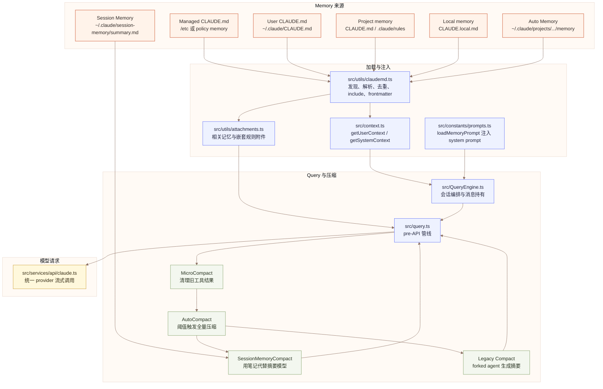
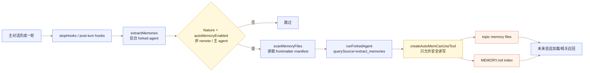
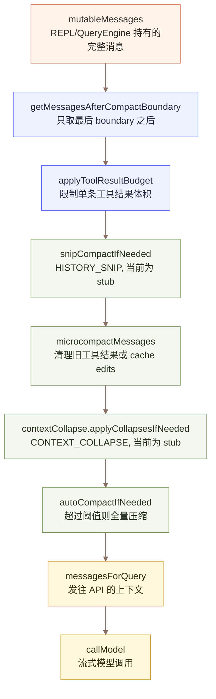
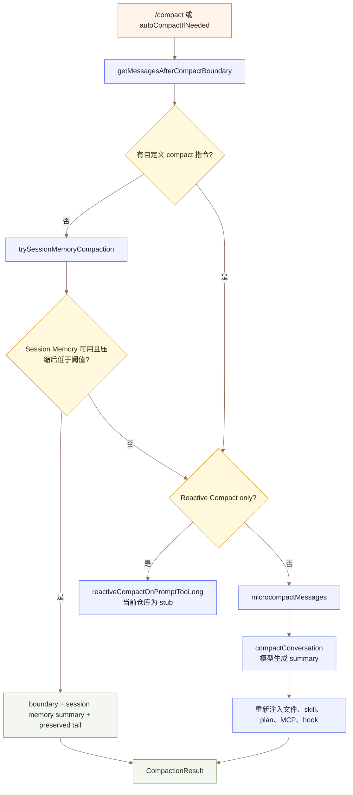
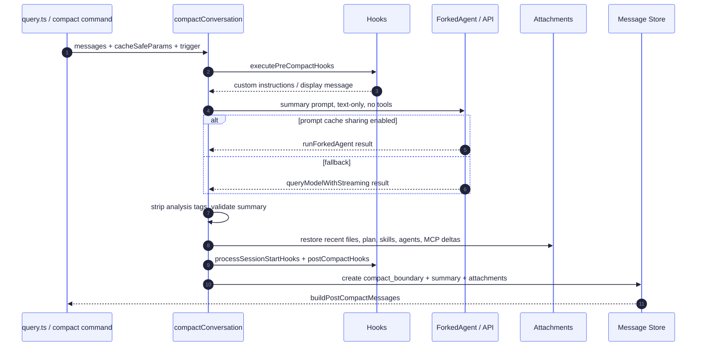

# Claude-CODE-BEST Memory 与 Context Compact 设计分析

本文从源码视角梳理 Claude-CODE-BEST 的 memory 管理与 Context Compact 上下文压缩机制。这里的 memory 不是单一概念，而是一组分层的上下文持久化与裁剪策略：有每轮注入的 `CLAUDE.md` 指令记忆，有跨会话的 auto memory，有后台提取的 Session Memory，也有面向上下文窗口压力的 compact 管线。

## 1. 总览

Claude-CODE-BEST 的上下文系统可以理解为两条主线：

1. **Memory 管理**：负责把稳定信息保存、发现、筛选并注入模型上下文，让模型跨轮次、跨会话延续偏好、项目规则和工作背景。
2. **Context Compact**：负责在上下文窗口接近上限时，把旧对话转化为摘要、保留近期原文并重新注入关键工作现场，避免 prompt too long。

两者的关系是：Memory 提供长期背景，Compact 管理当前会话历史。Session Memory 则位于两者之间，它是当前会话的结构化笔记，既用于续接工作，也可以成为 compact 的无模型调用摘要来源。



## 2. Memory 管理

### 2.1 Memory 类型与加载优先级

核心实现位于 `src/utils/claudemd.ts`。文件顶部注释已经明确了加载顺序：

| 类型 | 典型路径 | 作用 | 是否通常进入上下文 |
| --- | --- | --- | --- |
| Managed | `getMemoryPath('Managed')`、managed rules | 组织或策略级全局指令 | 是 |
| User | `~/.claude/CLAUDE.md`、user rules | 用户跨项目偏好 | 是 |
| Project | `CLAUDE.md`、`.claude/CLAUDE.md`、`.claude/rules/*.md` | 项目级协作规则 | 是 |
| Local | `CLAUDE.local.md` | 私有项目规则，不入库 | 是 |
| AutoMem | `~/.claude/projects/<repo>/memory/MEMORY.md` | 自动沉淀的跨会话记忆索引 | 是，或通过相关记忆附件进入 |
| TeamMem | auto memory 下的团队记忆目录 | 团队共享记忆 | feature `TEAMMEM` 开启时 |
| Session Memory | `~/.claude/session-memory/...` | 当前会话结构化笔记 | 不作为普通 CLAUDE.md 注入，主要服务 compact |

加载策略不是简单读取一个文件，而是：

- 从根目录到当前目录遍历，越靠近当前目录的项目记忆越晚加载，优先级更高。
- 支持 `CLAUDE.md`、`.claude/CLAUDE.md`、`.claude/rules/*.md`。
- 支持 frontmatter `paths`，规则可以只在特定目标路径相关时加载。
- 支持 `@path` include，但限制 include 深度，跳过二进制扩展，防止把图片、PDF 等塞进 prompt。
- 支持 `claudeMdExcludes`，可以排除特定 memory 文件。
- 自动去重、处理 symlink、处理 worktree 嵌套场景，避免同一仓库规则重复注入。

`getUserContext()` 会调用：

```text
getMemoryFiles()
  -> filterInjectedMemoryFiles()
  -> getClaudeMds()
  -> userContext.claudeMd
```

然后 `userContext` 会在模型请求前被 prepend 到消息中。`CLAUDE_CODE_DISABLE_CLAUDE_MDS` 可以硬关闭这一层；`--bare` 模式也会跳过自动发现，但仍可尊重显式 `--add-dir`。

### 2.2 Auto Memory: 跨会话文件化记忆

Auto Memory 的路径逻辑在 `src/memdir/paths.ts`：

```text
getAutoMemPath()
  -> CLAUDE_COWORK_MEMORY_PATH_OVERRIDE
  -> settings.autoMemoryDirectory
  -> ~/.claude/projects/<sanitized-git-root>/memory/
```

默认使用 canonical git root 作为项目 key，因此同一个仓库的不同 worktree 会共享一套 auto memory。入口文件是 `MEMORY.md`，它是索引，不应该承载大段记忆正文。真正的记忆内容被拆成 topic files，并带 frontmatter：name、description、type 等。

`src/memdir/memdir.ts` 给模型注入“如何保存记忆”的系统提示。它强调：

- 每条记忆写到独立 `.md` 文件。
- `MEMORY.md` 只放一行式索引。
- 按主题组织，不按时间流水账组织。
- 更新或删除过期记忆，避免重复。
- 不保存能从当前项目状态直接推导出的信息。
- 区分 memory、plan、task：memory 用于未来会话，plan/task 用于当前会话工作管理。



### 2.3 自动提取记忆

自动提取实现位于 `src/services/extractMemories/extractMemories.ts`。它在一次完整 query loop 结束后由 hook 触发，使用 forked agent 提取长期有价值的信息，写入 auto memory 目录。

关键设计点：

- **主线程无阻塞**：提取是 fire-and-forget 的后台任务，退出时可以 `drainPendingExtraction()` 等待。
- **游标推进**：用 `lastMemoryMessageUuid` 只处理新增的 model-visible messages。
- **并发合并**：如果提取正在运行，新上下文会被 stash 成 trailing run，避免多个提取 agent 重叠写。
- **互斥主 agent 写入**：如果主 agent 已经直接写了 auto memory，后台提取会跳过这段范围，避免重复记忆。
- **权限收窄**：`createAutoMemCanUseTool()` 允许 Read/Grep/Glob，允许只读 Bash，只允许 Edit/Write 到 auto memory 路径。
- **索引预注入**：提取前扫描已有 memory manifest，避免 agent 先花一轮 `ls`。

这是一种“主模型可主动记忆，后台模型补漏”的双保险模式。

### 2.4 相关记忆召回

Auto memory 的入口 `MEMORY.md` 会被注入上下文，但 topic files 可能很多，不能全量注入。因此 `src/memdir/findRelevantMemories.ts` 提供相关记忆选择：

1. `scanMemoryFiles()` 扫描最多 200 个 `.md` 文件的前 30 行 frontmatter。
2. `sideQuery()` 用 Sonnet 根据用户 query 与 memory manifest 选择最多 5 个相关记忆。
3. `attachments.ts` 读取这些文件并作为 `relevant_memories` attachment 注入。
4. 已经 surfaced 或已在 `readFileState` 中的文件会去重，compact 后旧 attachment 消失，允许未来重新召回。

这套召回把 memory 从“全部塞进 prompt”变成“索引常驻 + 内容按需召回”，降低长期记忆的 token 成本。

### 2.5 Session Memory: 当前会话笔记

Session Memory 位于 `src/services/SessionMemory/`，它和 auto memory 的目标不同：

- Auto Memory 面向未来会话，保存用户偏好、项目背景、反馈、参考信息。
- Session Memory 面向当前会话续接，保存当前任务状态、文件、错误、命令、工作日志。

默认模板在 `src/services/SessionMemory/prompts.ts`，包含：Session Title、Current State、Task specification、Files and Functions、Workflow、Errors & Corrections、Codebase and System Documentation、Learnings、Key results、Worklog。

Session Memory 的提取由 post-sampling hook 触发，入口是 `initSessionMemory()`：

- 只在 main REPL thread 运行，跳过 subagents。
- poor mode 下跳过，减少 token 消耗。
- 依赖 `tengu_session_memory` gate。
- auto compact 关闭时不初始化，因为它主要服务 compaction。
- 初始阈值默认 `minimumMessageTokensToInit = 10000`。
- 更新阈值默认 `minimumTokensBetweenUpdate = 5000` 且 `toolCallsBetweenUpdates = 3`。
- 用 `runForkedAgent(querySource='session_memory')` 更新 session memory 文件。
- `createMemoryFileCanUseTool()` 只允许 Edit 精确目标 memory 文件。

Session Memory 成功提取后会记录 `lastSummarizedMessageId`。后续 Session Memory Compact 就能知道“哪些消息已经写进笔记，哪些近期消息还必须原文保留”。

## 3. Context Compact 上下文压缩

### 3.1 Query 前的压缩管线

压缩管线在 `src/query.ts` 的每轮 loop 开头执行。其目标是构造真正发给模型的 `messagesForQuery`：



其中 `getMessagesAfterCompactBoundary()` 是关键分界线。每次全量 compact 成功后都会插入 `system/subtype=compact_boundary`。后续 API 调用只看最后一个 boundary 之后的消息，因此旧历史不会无限增长。

### 3.2 MicroCompact: 局部清理旧工具输出

MicroCompact 位于 `src/services/compact/microCompact.ts`。它不生成摘要，也不删除消息，主要处理工具结果过大、过旧的问题。

可压缩工具包括：Read、Shell、Grep、Glob、WebSearch、WebFetch、Edit、Write。

当前主要路径：

| 路径 | 触发 | 行为 | 优点 |
| --- | --- | --- | --- |
| Time-based MicroCompact | 主线程距离上次 assistant 超过配置分钟数 | 保留最近 N 个可压缩 tool result，其余替换为 `[Old tool result content cleared]` | cache 已冷，直接减小下次 prompt |
| Cached MicroCompact | feature `CACHED_MICROCOMPACT` 且模型支持 cache editing | 不改本地消息，通过 cache edits 删除服务端缓存中的工具结果 | 尽量保留 prompt cache 命中 |

Time-based 配置来自 `src/services/compact/timeBasedMCConfig.ts`，默认关闭，阈值默认 60 分钟，保留最近 5 个工具结果。

### 3.3 AutoCompact 阈值

AutoCompact 位于 `src/services/compact/autoCompact.ts`。它先计算模型有效窗口：

```text
effectiveContextWindow = modelContextWindow - min(modelMaxOutputTokens, 20_000)
autoCompactThreshold = effectiveContextWindow - 13_000
```

当 `tokenCountWithEstimation(messages)` 超过阈值时触发自动 compact。它还包含几个重要保护：

- `DISABLE_COMPACT` 关闭所有 compact。
- `DISABLE_AUTO_COMPACT` 只关闭自动 compact，手动 `/compact` 仍可用。
- `querySource === 'session_memory' | 'compact'` 时禁止递归 compact，避免 forked agent 死锁。
- Reactive-only 或 Context Collapse 模式下会抑制 proactive autocompact，让对应系统接管。
- 连续失败达到 3 次后触发 circuit breaker，避免每轮都发起注定失败的 compact。

### 3.4 `/compact` 与 AutoCompact 的优先级链

手动 `/compact` 位于 `src/commands/compact/compact.ts`，自动 compact 通过 `autoCompactIfNeeded()` 调 `compactConversation()`。两者最终都生产 `CompactionResult`。



优先级可以概括为：

1. 没有自定义指令时，优先用 Session Memory Compact。
2. Reactive Compact 是实验路径，当前反编译仓库为 stub。
3. 兜底用传统摘要 compact，先 microcompact 再调用模型摘要。

### 3.5 Session Memory Compact

Session Memory Compact 位于 `src/services/compact/sessionMemoryCompact.ts`。它的优势是不需要再调用摘要模型，直接使用已经维护好的 session memory 文件作为 compact summary。

核心步骤：

1. 检查 `tengu_session_memory` 和 `tengu_sm_compact`，或环境变量 `ENABLE_CLAUDE_CODE_SM_COMPACT`。
2. 等待正在进行的 session memory extraction，最多等待 15 秒，超过 1 分钟的 extraction 视为 stale。
3. 读取 session memory 文件，空模板则放弃，回退传统 compact。
4. 根据 `lastSummarizedMessageId` 找到已总结边界。
5. 调 `calculateMessagesToKeepIndex()` 保留近期原文窗口。
6. 创建 `compact_boundary`、summary message、plan attachment、session start hook results。

保留窗口默认配置：

| 配置 | 默认值 | 含义 |
| --- | ---: | --- |
| `minTokens` | 10,000 | 压缩后至少保留这么多近期上下文 |
| `minTextBlockMessages` | 5 | 至少保留 5 条有文本内容的消息 |
| `maxTokens` | 40,000 | 近期窗口硬上限，避免刚压完又触发压缩 |

最重要的正确性函数是 `adjustIndexToPreserveAPIInvariants()`。它避免压缩边界切断：

- `tool_use` 与 `tool_result` 配对。
- 流式 assistant 消息中共享同一个 `message.id` 的 thinking/tool_use 分片。

这类保护非常关键，否则压缩后会出现孤儿 `tool_result`，API 会直接拒绝请求。

### 3.6 传统摘要 Compact

传统 compact 位于 `src/services/compact/compact.ts` 的 `compactConversation()`。

它的流程是：



摘要 prompt 在 `src/services/compact/prompt.ts` 中。它要求输出 `<analysis>` 和 `<summary>`，随后 `formatCompactSummary()` 会移除 `<analysis>` 草稿，只保留整理后的 summary。

传统 compact 前会做两个减负动作：

- `stripImagesFromMessages()`：图片、文档替换为 `[image]` / `[document]`。
- `stripReinjectedAttachments()`：移除压缩后会重新注入的 skill discovery/listing 等附件。

如果 compact 请求本身触发 prompt too long，则 `truncateHeadForPTLRetry()` 会按 API round 从头丢弃旧消息，最多重试 3 次。这是最后兜底，牺牲精度换可恢复性。

### 3.7 CompactBoundary 与压缩后消息结构

每次全量 compact 成功后都会创建：

```text
SystemMessage subtype = compact_boundary
compactMetadata = {
  trigger: 'manual' | 'auto',
  preTokens,
  userContext?,
  messagesSummarized?,
  preCompactDiscoveredTools?,
  preservedSegment?
}
```

`buildPostCompactMessages()` 统一输出顺序：

```text
boundaryMarker
summaryMessages
messagesToKeep
attachments
hookResults
```

其中 `preservedSegment` 用于恢复/加载时重建保留消息链，避免由于 dedup 或 parentUuid 断裂导致保留段被错误裁掉。

REPL 和 SDK 都会对 boundary 做特殊处理：

- 普通 REPL 模式下，compact 后消息列表替换成从 boundary 开始的新消息。
- fullscreen 模式保留一个 compact 区间的 scrollback，但 API 视图仍从 boundary 后开始。
- QueryEngine 收到 boundary 后会释放 boundary 前的 mutable messages，降低长会话内存占用。

### 3.8 压缩后的上下文重新注入

压缩不是只保留一个 summary。系统还会把关键工作现场重新注入：

| 内容 | 来源 | 限制 |
| --- | --- | --- |
| 最近读取文件 | `readFileState` | 最多 5 个，每个最多 5K token，总预算 50K |
| invoked skills | bootstrap state | 每个最多 5K token，技能总预算 25K |
| plan 文件 | plan store | 有 plan 时注入 |
| plan mode 状态 | permission mode | 保证 compact 后仍保持 plan mode |
| async agent 状态 | AppState tasks | 避免重复派生 agent，保留未取回结果 |
| deferred tools / agent listing / MCP instructions | 当前工具与 MCP 状态 | 补回 summary 无法表示的 tool schema/instruction delta |
| session start hook results | hooks | 重新加载 CLAUDE.md 等启动上下文 |

这说明 compact 的设计目标不是“压成一句摘要”，而是“构造一个能继续工作的最小上下文包”。

## 4. Component 关系总结

| Component | 位置 | 职责 | 关系 |
| --- | --- | --- | --- |
| `claudemd.ts` | `src/utils/claudemd.ts` | 发现并解析 CLAUDE.md、rules、AutoMem、TeamMem | 给 `context.ts` 和 attachment 系统提供 memory 文件 |
| `context.ts` | `src/context.ts` | 构造 userContext/systemContext | 把 `claudeMd` 与日期、git status 等注入 query |
| `memdir.ts` | `src/memdir/memdir.ts` | 生成 auto memory 的行为提示，确保目录存在 | 被 system prompt 和 Agent memory 使用 |
| `extractMemories.ts` | `src/services/extractMemories` | 后台从对话提取长期记忆 | 写入 auto memory topic files 与 `MEMORY.md` |
| `findRelevantMemories.ts` | `src/memdir` | 按 query 选择相关记忆 | 通过 attachments 注入最多 5 个 topic files |
| `SessionMemory` | `src/services/SessionMemory` | 维护当前会话结构化笔记 | 给 Session Memory Compact 提供摘要来源 |
| `query.ts` | `src/query.ts` | 每轮 query 的上下文预处理与模型循环 | 串起 microcompact、autocompact、context collapse |
| `autoCompact.ts` | `src/services/compact` | 判断是否自动 compact | 调用 Session Memory Compact 或传统 compact |
| `sessionMemoryCompact.ts` | `src/services/compact` | 用 session memory 生成 compact result | 无需摘要模型，保留近期消息 |
| `compact.ts` | `src/services/compact` | 传统摘要 compact 与 partial compact | 生成 boundary、summary、attachments |
| `messages.ts` | `src/utils/messages.ts` | 创建 boundary，裁剪 boundary 后视图 | 是 compact 后所有后续 query 的分界机制 |

## 5. 设计思路总结

Claude-CODE-BEST 的 memory 与 compact 设计有几个核心取向。

### 5.1 分层记忆，而不是一个全局大 prompt

项目规则、用户偏好、自动记忆、团队记忆、会话笔记分别放在不同系统里。稳定规则用 `CLAUDE.md` 直接注入；大量长期记忆用索引常驻和按需召回；当前会话进度用 Session Memory；旧聊天历史用 Compact Summary。

这样能避免一个常见问题：所有信息都塞进 prompt，导致上下文窗口被低价值背景挤满。

### 5.2 文件系统作为可审计的 memory backend

Auto memory 和 Session Memory 都是 Markdown 文件。好处是：

- 用户和模型都可以读写、编辑、删除。
- 易于审计和迁移。
- 可以通过 frontmatter 建立轻量索引。
- 可以和权限系统结合，限制 agent 只能写指定目录或指定文件。

### 5.3 主循环保持快，后台 agent 做重活

自动提取记忆、Session Memory 更新、compact 摘要都使用 forked agent 或 side query。主循环只在必要时等待 compact，平时尽量不阻塞用户交互。

### 5.4 Cache-aware

很多实现细节都围绕 prompt cache：

- compact summary 优先走 forked agent，共享主对话 cache prefix。
- cached microcompact 使用 cache edits，尽量不破坏本地消息。
- compact 后调用 `notifyCompaction()`，避免把预期的 cache drop 误判为异常。
- `loadMemoryPrompt()` 作为 system prompt section 缓存，避免频繁变动前缀。

### 5.5 正确性优先于简单切片

Compact 不是粗暴截断。它必须维护 API 消息不变量：

- `tool_use` 必须有对应 `tool_result`。
- 流式 assistant 分片必须一起保留。
- boundary 需要记录 preserved segment 以便恢复链路。
- 图片、文档、附件要在摘要前后做不同处理。

这些设计保证了长会话压缩后还能继续执行工具，而不是只适合纯文本聊天。

### 5.6 失败可恢复

AutoCompact 有 circuit breaker，compact 请求自身 PTL 有截断重试，Session Memory 不可用会回退传统摘要。实验性路径如 Reactive Compact、Context Collapse 在当前仓库中保留接口但实现为 stub，不影响主链路稳定性。

## 6. 面试角度的问题与解答

### Q1: 这个项目里的 memory 和 compact 有什么区别？

**答**：Memory 管理长期或中期信息，决定哪些外部知识、偏好、项目规则进入上下文；Compact 管理当前会话历史膨胀，决定旧消息如何被摘要或裁剪。Auto Memory 面向跨会话复用，Session Memory 面向当前会话续接，Compact Summary 面向上下文窗口压力下继续工作。

### Q2: 为什么不直接把所有 memory 文件都注入 prompt？

**答**：长期记忆会增长，全部注入会挤占工作上下文，降低模型对当前任务的注意力，也增加成本。Claude-CODE-BEST 用 `MEMORY.md` 作为常驻索引，再用 `findRelevantMemories()` 根据 query 选择最多 5 个 topic files 注入，实现索引常驻、内容按需召回。

### Q3: Auto Memory 为什么用 Markdown 文件，而不是数据库？

**答**：Markdown 文件可读、可编辑、可审计，适合 CLI 编程助手。模型可以用已有 FileRead/Edit/Write 工具操作它，用户也可以直接查看。frontmatter 提供足够的轻量索引能力，避免引入数据库依赖和迁移复杂度。

### Q4: 自动提取记忆如何避免污染或越权？

**答**：后台提取 agent 使用 `createAutoMemCanUseTool()` 收窄权限：只允许读工具、只读 shell，以及写 auto memory 目录。Team memory 还通过 secret guard 扫描潜在密钥，防止共享记忆泄露敏感信息。

### Q5: Session Memory Compact 为什么比传统 Compact 便宜？

**答**：传统 Compact 需要再调用一次模型总结完整历史；Session Memory Compact 直接使用后台已经维护好的会话笔记作为 summary，不需要额外摘要调用。它只计算保留窗口、创建 boundary 和 summary message，因此 token 与延迟成本更低。

### Q6: Session Memory Compact 最大风险是什么？怎么缓解？

**答**：风险是 session memory 不完整或过期。项目通过 `lastSummarizedMessageId` 标记已总结位置，并保留近期原文窗口。默认至少保留 10K token 和 5 条文本消息，且如果 session memory 为空模板、找不到 summarized id、或压缩后仍超阈值，就回退传统 compact。

### Q7: Compact 为什么需要 `compact_boundary`？

**答**：Boundary 是压缩后的逻辑分界点。后续 query 通过 `getMessagesAfterCompactBoundary()` 只发送 boundary 之后的消息，避免旧历史重复进入 API。它还携带 trigger、preTokens、preservedSegment、preCompactDiscoveredTools 等元数据，帮助恢复、SDK 输出和 prompt cache 诊断。

### Q8: 为什么不能简单保留最后 N 条消息？

**答**：工具调用消息有严格配对关系。只按条数切片可能保留了 `tool_result` 但丢掉对应 `tool_use`，或者丢掉同一 assistant response 的 thinking 分片，导致 API 400。`adjustIndexToPreserveAPIInvariants()` 正是为了解决这个问题。

### Q9: MicroCompact 和 AutoCompact 的区别是什么？

**答**：MicroCompact 是局部优化，主要清理旧工具结果内容或服务端 cache 中的工具结果，不生成 summary，也不改变会话语义结构。AutoCompact 是全量压缩，在 token 超阈值时把旧对话总结为 summary，并重建 post-compact 消息包。

### Q10: Compact 后为什么还要重新注入最近文件和 skills？

**答**：摘要很难完整保留代码细节、skill 指令、plan mode 状态和 MCP/tool schema 状态。如果 compact 后只剩 summary，模型会丢失继续工作的执行现场。因此系统重新注入最近读过的文件、已调用 skills、plan、async agent 状态和 MCP/tool delta。

### Q11: AutoCompact 阈值为什么要扣掉 max output tokens 和 13K buffer？

**答**：上下文窗口不只承载输入，还要为模型输出留空间。`effectiveContextWindow` 先扣掉最多 20K summary/output 预算，再扣 13K autocompact buffer，避免刚到硬上限才开始压缩，给 compact 和后续工具循环留出安全余量。

### Q12: 如果 compact 本身也 prompt too long 怎么办？

**答**：传统 compact 会使用 `truncateHeadForPTLRetry()` 按 API round 丢弃最旧消息，最多重试 3 次。这是有损但可恢复的兜底策略，目标是避免用户卡死在无法 compact、也无法继续 query 的状态。

### Q13: 为什么 Context Collapse、Reactive Compact 还存在但当前是 stub？

**答**：这是反编译/恢复型仓库常见状态：接口和布线保留，方便后续恢复或 feature-gated 实验，但当前外部实现为空操作。主链路不能依赖它们，因此稳定路径仍是 MicroCompact、Session Memory Compact 和传统摘要 Compact。

### Q14: 如何评价这个设计的优点？

**答**：它把长期记忆、当前会话笔记、旧历史摘要和工具现场恢复分层处理，避免单一大 prompt。它注重 cache、权限、安全和 API 消息不变量，适合长期运行的 agentic coding session。

### Q15: 这个设计可能的缺点是什么？

**答**：系统复杂度高，feature gate 多，链路上有多个异步后台 agent 和缓存状态，调试成本不低。Session Memory 或 Auto Memory 的质量依赖提取 prompt 和模型行为；如果记忆写得不准，后续 compact 和召回都会受影响。因此需要良好的 telemetry、回退路径和用户可编辑的文件化存储。

## 7. 一句话总结

Claude-CODE-BEST 的 memory 管理是“文件化长期记忆 + 按需召回 + 会话笔记”的组合；Context Compact 是“boundary 切分 + 摘要替代旧历史 + 近期原文保留 + 工作现场重新注入”的组合。前者解决跨会话连续性，后者解决长会话上下文窗口压力，二者共同支撑一个能长期工作的编程 Agent。