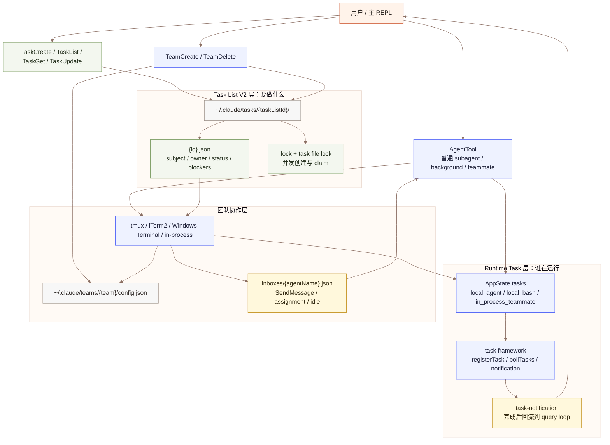
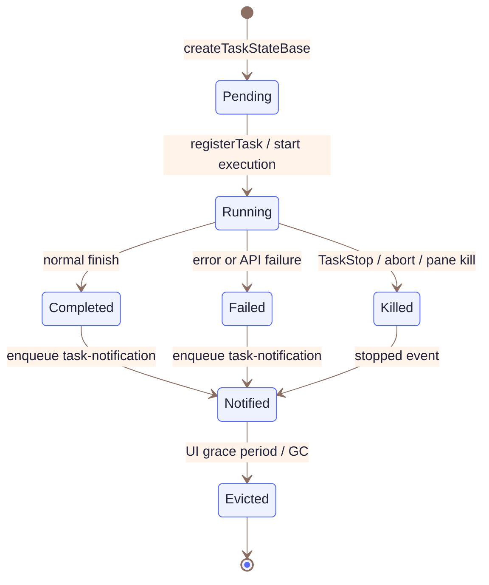
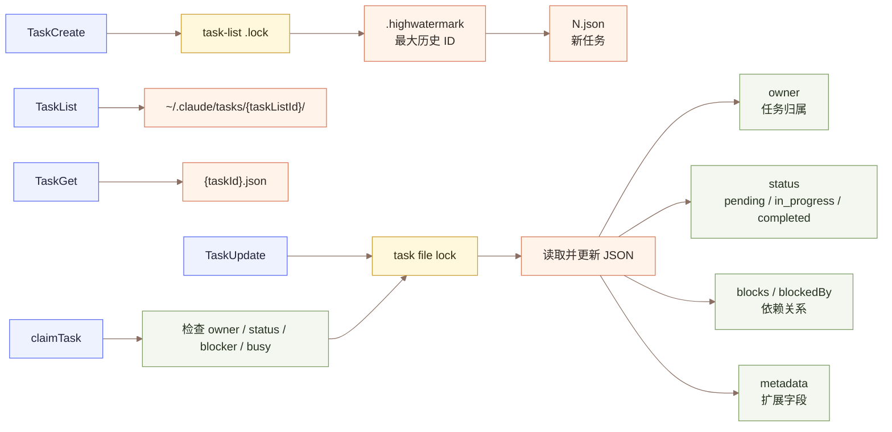
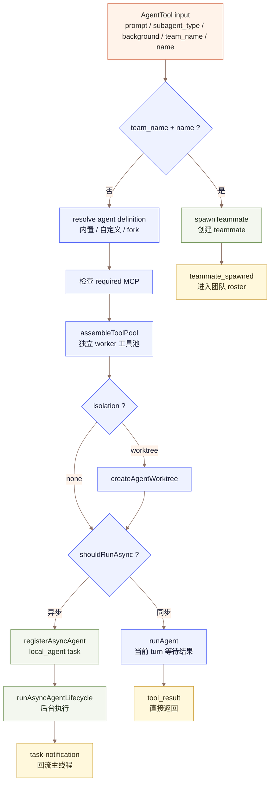
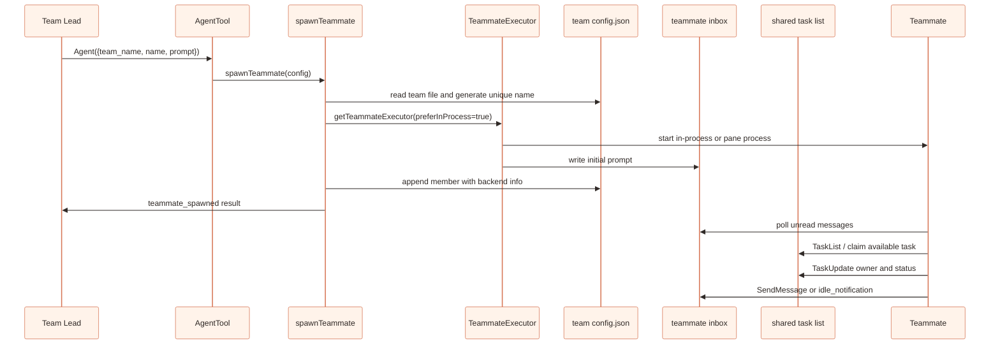
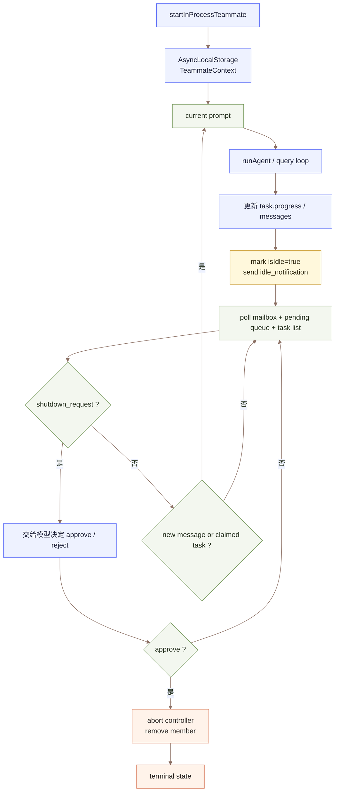
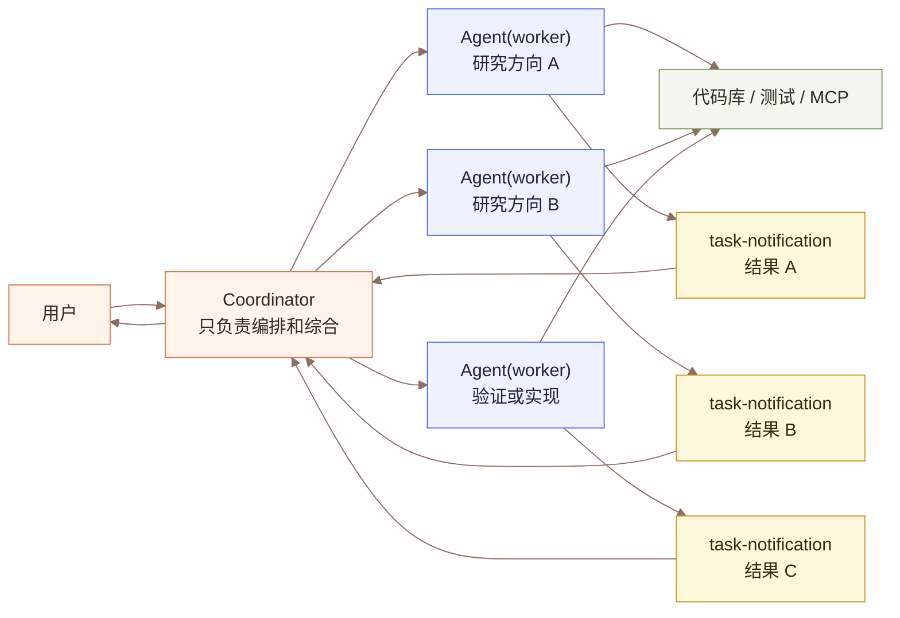

# Claude-CODE-BEST 任务系统与多 Agent 团队协作设计分析

本文从源码视角梳理 Claude-CODE-BEST 如何实现任务系统，以及如何在此基础上构建多 agent 团队协作。这里的“任务”不是单一概念，而是两套互相配合的机制：一套是用于 UI、后台执行和生命周期管理的 **Task Runtime**；另一套是用于团队分工和协作的 **Task List V2**。多 agent 协作则把 AgentTool、TeamCreate、Mailbox、Task List 和不同执行后端组合起来，形成可并发、可通信、可恢复的团队运行时。

## 1. 源码地图

| 模块 | 关键文件 | 职责 |
| --- | --- | --- |
| Task Runtime | `src/Task.ts`、`src/tasks/types.ts`、`src/utils/task/framework.ts` | 定义后台任务类型、状态、注册、通知、轮询、停止和清理 |
| Task List V2 | `src/utils/tasks.ts` | 文件型任务队列，支持创建、读取、更新、删除、依赖、claim、锁 |
| Task 工具 | `packages/builtin-tools/src/tools/TaskCreateTool/`、`TaskListTool/`、`TaskGetTool/`、`TaskUpdateTool/` | 暴露给模型的任务管理工具 |
| AgentTool | `packages/builtin-tools/src/tools/AgentTool/AgentTool.tsx`、`runAgent.ts` | subagent、background agent、fork agent、teammate spawn 的统一入口 |
| LocalAgentTask | `src/tasks/LocalAgentTask/LocalAgentTask.tsx` | 普通后台 subagent 的 AppState 任务状态与进度追踪 |
| InProcessTeammateTask | `src/tasks/InProcessTeammateTask/` | in-process teammate 的生命周期、消息队列、idle 状态和 transcript UI |
| Team 工具 | `packages/builtin-tools/src/tools/TeamCreateTool/`、`TeamDeleteTool/` | 创建和销毁 agent team，建立 team file 与共享 task list |
| Swarm 后端 | `src/utils/swarm/backends/` | 统一抽象 tmux、iTerm2、Windows Terminal、in-process teammate 执行方式 |
| Mailbox | `src/utils/teammateMailbox.ts`、`SendMessageTool/` | 基于文件的 teammate 消息系统，支持私信、广播、权限、shutdown、任务分配 |
| Coordinator Mode | `src/coordinator/coordinatorMode.ts`、`workerAgent.ts` | 中心化 coordinator + worker 的异步编排模式 |

## 2. 总览：两层任务系统

Claude-CODE-BEST 中有两种容易混淆的 Task：

1. **Runtime Task**：表示一个正在运行或刚结束的后台工作单元，例如 bash、background subagent、remote agent、in-process teammate。它存在于 `AppState.tasks`，用于 UI 展示、输出追踪、停止和通知。
2. **Task List V2 Task**：表示模型或团队要完成的待办事项，例如“修复鉴权 bug”“补充测试”。它以 JSON 文件形式存在于 `~/.claude/tasks/{taskListId}/`，用于多 agent 分工、领取、依赖和完成状态。

多 agent 团队协作就是把这两层叠起来：Runtime Task 负责“agent 怎么跑”，Task List V2 负责“agent 做什么”。



## 3. Task Runtime：后台执行任务

Runtime Task 的类型定义在 `src/Task.ts`：

| TaskType | 说明 |
| --- | --- |
| `local_bash` | Bash / PowerShell 等本地 shell 任务 |
| `local_agent` | AgentTool 启动的后台 subagent |
| `remote_agent` | 远程 CCR / Remote Control 任务 |
| `in_process_teammate` | 同进程内运行的 teammate |
| `local_workflow` | Workflow 任务 |
| `monitor_mcp` | MCP 监控任务 |
| `dream` | Dream / 实验性任务 |

统一状态是：`pending`、`running`、`completed`、`failed`、`killed`。其中 `completed/failed/killed` 是 terminal state，不再接受消息注入，也可以被 UI GC。

### 3.1 Runtime Task 的生命周期

Runtime Task 的公共字段由 `createTaskStateBase()` 创建：

- `id`：带前缀的随机 ID，比如 `a...` 表示 local agent，`t...` 表示 in-process teammate。
- `type`：任务类型。
- `status`：运行状态。
- `description`：UI 和 notification 展示用。
- `toolUseId`：触发该任务的 tool_use。
- `outputFile`：任务输出文件路径。
- `outputOffset`：已消费输出偏移。
- `notified`：是否已经把终态通知送回主循环。



### 3.2 注册、轮询与通知

`src/utils/task/framework.ts` 是 Runtime Task 的小框架：

- `registerTask()`：把 task 放入 `AppState.tasks`，并发出 SDK `task_started` 事件。
- `updateTaskState()`：类型安全地更新某个 task。
- `pollTasks()`：扫描 running task 的 output file，读取新增输出。
- `generateTaskAttachments()`：为有新输出的任务生成附件。
- `enqueueTaskNotification()`：把终态转换成 `task-notification` XML，放入 message queue。
- `evictTerminalTask()`：终态任务被消费后从 AppState 清理。

`query.ts` 在每轮模型调用前会 drain message queue。主线程只消费 `agentId === undefined` 的 prompt / task-notification；subagent 只消费发给自己的 task-notification。这个设计避免 in-process subagent 和主线程抢同一个全局队列。

### 3.3 停止任务

`TaskStopTool` 调用 `src/tasks/stopTask.ts`：

1. 从 `AppState.tasks` 查找 task。
2. 校验状态必须是 `running`。
3. 通过 `getTaskByType(task.type)` 找到具体 task 实现。
4. 调用该类型的 `kill()`。
5. 对 shell task 抑制噪音型 XML notification，同时直接发 SDK terminated event。

Runtime Task 是多 agent 能被 UI 管理、能后台执行、能取消和能回报结果的基础设施。

## 4. Task List V2：团队共享待办队列

Task List V2 的核心在 `src/utils/tasks.ts`。它是一个文件系统协议，而不是内存结构或数据库。



### 4.1 taskListId 的解析

`getTaskListId()` 决定当前 agent 读写哪个 task list，优先级是：

1. `CLAUDE_CODE_TASK_LIST_ID`：显式指定，适合 SDK 或 CLI 任务模式。
2. in-process teammate context 的 `teamName`：同进程队友共享 leader 的 team task list。
3. process teammate 的 dynamic team context：tmux/iTerm2/Windows Terminal 进程通过 CLI 参数加入 team。
4. leader 创建 team 时的 `leaderTeamName`。
5. 当前 `sessionId`：普通单人会话 fallback。

这使得同一套 Task 工具可以同时服务单人 TODO、任务模式和团队协作。

### 4.2 Task 数据结构

Task V2 的 schema 包含：

| 字段 | 说明 |
| --- | --- |
| `id` | 数字字符串，按 `.highwatermark` 递增 |
| `subject` | 简短标题 |
| `description` | 详细任务说明 |
| `activeForm` | in_progress 时 UI 展示的动词短语 |
| `owner` | agent 名称或 ID，表示任务已被谁领取 |
| `status` | `pending`、`in_progress`、`completed` |
| `blocks` | 当前任务阻塞哪些任务 |
| `blockedBy` | 当前任务被哪些任务阻塞 |
| `metadata` | 扩展字段，可用于内部标记、UI、hook 数据 |

`deleteTask()` 会删除 JSON 文件，并从其他任务的 `blocks/blockedBy` 中清理引用，同时更新 `.highwatermark`，防止 ID 被复用。

### 4.3 并发与 claim

多 agent 最怕的问题是两个 agent 同时领取同一个任务。Claude-CODE-BEST 的处理策略是：

- 创建任务时锁 task-list `.lock`，在锁内读取最高 ID、写入新 JSON。
- 更新任务时锁单个 task JSON 文件。
- claim 时锁 task 文件，重新读取任务，检查 owner、status、blocker，再写 owner。
- `checkAgentBusy` 模式下锁 task-list `.lock`，把“该 agent 是否已有未完成任务”和“领取新任务”放进同一个临界区。

`claimTask()` 的失败原因是显式枚举：`task_not_found`、`already_claimed`、`already_resolved`、`blocked`、`agent_busy`。这比简单抛异常更适合 agent 协议，因为模型可以根据 reason 决定下一步。

### 4.4 Task 工具如何映射到文件协议

| 工具 | 行为 | 协作含义 |
| --- | --- | --- |
| TaskCreate | 新建 `pending` 任务，触发 TaskCreated hooks | leader 拆任务，teammate 发现新工作 |
| TaskList | 列出任务状态、owner、未完成 blocker | agent 观察全局进度和可领取任务 |
| TaskGet | 读取单个任务完整描述和依赖 | agent 获取任务细节 |
| TaskUpdate | 更新字段、owner、status、依赖、metadata | 分配任务、领取任务、完成任务、标记阻塞 |

`TaskUpdate` 在 Swarm 中还有两个额外职责：

- 当 teammate 把任务标记为 `in_progress` 且 owner 为空时，自动用当前 agentName 填 owner。
- 当 owner 变化时，向新 owner 的 mailbox 写入 `task_assignment` 消息。

## 5. AgentTool：subagent 与 teammate 的统一入口

`AgentTool` 是多 agent 的核心入口。它根据输入参数和 feature 状态选择不同路径。



普通 subagent 和 teammate 都复用 `runAgent()` 这套 agent loop：构造 system prompt、user/system context、工具列表、MCP clients、权限上下文、sidechain transcript，然后调用核心 `query()`。

### 5.1 三种常见 subagent 路径

| 路径 | 触发条件 | 特点 |
| --- | --- | --- |
| 同步 subagent | 默认非 background | 当前 AgentTool 调用等待完成，结果作为 tool_result 返回 |
| 异步 background agent | `run_in_background`、agent 定义 `background`、Coordinator Mode、fork gate 等 | 注册 `local_agent` Runtime Task，完成后发 notification |
| fork subagent | fork subagent gate 开启且未显式指定 `subagent_type` | 复用父级 system prompt、工具定义和上下文前缀，提高 prompt cache 命中 |

### 5.2 工具池与权限隔离

AgentTool 不把父 agent 的工具限制直接透传给 worker，而是重新组装工具池：

```text
workerPermissionContext = parent.toolPermissionContext + selectedAgent.permissionMode
workerTools = assembleToolPool(workerPermissionContext, appState.mcp.tools)
runAgent(... availableTools = workerTools ...)
```

之后 `runAgent()` 再根据 agent definition 的 `tools/disallowedTools/permissionMode` 做二次过滤。异步 agent 默认不能弹权限 UI，所以会设置 `shouldAvoidPermissionPrompts`。in-process teammate 是例外，它虽然异步，但和 leader 同进程共享终端，因此可以把权限请求桥接到 leader UI。

## 6. Agent Swarms：Team + Teammate + Task List + Mailbox

Agent Swarms 是 Claude-CODE-BEST 中更完整的团队协作模式。它不是简单“开几个后台 agent”，而是构建了一个团队运行时。

### 6.1 TeamCreate 做了什么

`TeamCreateTool` 做四件关键事情：

1. 创建 team config：`~/.claude/teams/{team}/config.json`。
2. 创建或重置 task list：`~/.claude/tasks/{team}/`。
3. 设置 `leaderTeamName`，让 leader 的 Task 工具也写入 team task list。
4. 更新 `AppState.teamContext`，记录 leader 和 teammates roster。

Team 文件中保存：team 名称、描述、创建时间、leadAgentId、leadSessionId、members、pane 信息、cwd、worktree、backendType、isActive、mode 等。

### 6.2 Teammate spawn 流程

当 AgentTool 收到 `team_name` 和 `name` 时，会调用 `spawnTeammate()`：



### 6.3 执行后端

Swarm 后端统一为 `TeammateExecutor`：

| 后端 | 实现 | 特点 |
| --- | --- | --- |
| in-process | `InProcessBackend`、`spawnInProcess.ts`、`inProcessRunner.ts` | 同进程运行，AsyncLocalStorage 隔离身份，共享资源，适合非交互或无 pane 环境 |
| tmux | `TmuxBackend` + `PaneBackendExecutor` | 新建 tmux pane 或外部 swarm session，可视化并行工作 |
| iTerm2 | `ITermBackend` + `PaneBackendExecutor` | 使用 iTerm2 native split panes |
| Windows Terminal | `WindowsTerminalBackend` + `PaneBackendExecutor` | Windows 下通过 `wt.exe` 启动 teammate |

`registry.ts` 负责后端选择：显式 `--teammate-mode` 优先；auto 模式下根据当前是否在 tmux、iTerm2、Windows Terminal，以及是否非交互，选择 pane 或 in-process。没有 pane 后端时，auto 会 fallback 到 in-process。

### 6.4 In-process teammate 的持续循环

in-process teammate 不是一次性 background agent。它在 `inProcessRunner.ts` 中执行一个持续循环：

1. 使用 `runWithTeammateContext()` 设置 AsyncLocalStorage 身份。
2. 使用 `runWithAgentContext()` 标记 analytics 和 tracing 归属。
3. 调用普通 `runAgent()` 处理当前 prompt。
4. 将消息追加到 `task.messages`，用于 teammate transcript UI。
5. 当前 prompt 完成后进入 idle，向 team lead mailbox 发送 `idle_notification`。
6. 等待下一条 mailbox 消息、pending user message、shutdown request，或尝试 claim shared task list 中的可用任务。
7. 如果上下文过长，内部也会调用 compact，把 teammate 自己的历史压缩。



### 6.5 Mailbox 通信

Mailbox 是文件型消息总线：

```text
~/.claude/teams/{team}/inboxes/{agentName}.json
```

每条消息包含：`from`、`text`、`timestamp`、`read`、`color`、`summary`。写入时先确保 inbox 文件存在，再用 lockfile 加锁，重新读取、append、写回。

支持的消息类型包括：

| 消息类型 | 用途 |
| --- | --- |
| 普通文本 | teammate 私信或广播 |
| `task_assignment` | TaskUpdate owner 变化后通知新 owner |
| `idle_notification` | teammate 一轮结束后通知 leader 自己空闲 |
| `permission_request` / `permission_response` | teammate 工具权限请求和 leader 响应 |
| `sandbox_permission_request` / response | sandbox 网络访问审批 |
| `plan_approval_request` / response | plan mode teammate 请求 leader 审批 |
| `shutdown_request` / approved / rejected | team cleanup 或 leader 请求 teammate 退出 |
| `team_permission_update` | leader 向 team 广播权限更新 |

`SendMessageTool` 的路由策略是：

1. 如果目标是 running in-process/local agent，优先写入 AppState pending queue，或尝试 resume stopped agent。
2. 如果 `to: "*"`，读取 team file 后广播给所有其他 members。
3. 否则写入目标 teammate 的 mailbox。
4. 特殊地址如 `bridge:`、`uds:`、`tcp:` 在对应 feature 开启时走跨会话或局域网通信。

## 7. Coordinator Mode：中心化 worker 编排

Coordinator Mode 与 Agent Swarms 都是多 agent，但抽象不同。

Coordinator Mode 通过 `feature('COORDINATOR_MODE')` 和 `CLAUDE_CODE_COORDINATOR_MODE=1` 开启。核心文件是 `src/coordinator/coordinatorMode.ts` 和 `src/coordinator/workerAgent.ts`。

开启后：

- built-in agents 只暴露 `worker` agent。
- coordinator 自己的工具被限制为 `Agent`、`TaskStop`、`SendMessage`、`SyntheticOutput`。
- worker 使用 `ASYNC_AGENT_ALLOWED_TOOLS` 中的标准工具，但排除 TeamCreate、TeamDelete、SendMessage、SyntheticOutput 等内部编排工具。
- worker 结果通过 `task-notification` XML 作为 user-role message 回到 coordinator。
- coordinator prompt 强调：研究可并行，实施要谨慎，必须自己综合 worker 发现，不能写“根据你的发现”这种懒委托。



Coordinator Mode 更像“项目经理 + 工人”的星型拓扑；Agent Swarms 更像“团队 + 共享任务板 + 私信”的协作拓扑。

## 8. 组件关系总结

| Component | 直接上游 | 直接下游 | 核心关系 |
| --- | --- | --- | --- |
| `AgentTool` | 模型 tool_use | `runAgent`、`spawnTeammate`、Runtime Task | 所有 subagent 和 teammate 的入口 |
| `runAgent` | AgentTool / inProcessRunner / resumeAgent | `query()` | 复用主对话 loop，构造 agent 专属上下文 |
| `LocalAgentTask` | async AgentTool | task framework / SendMessage | 后台 subagent 的 Runtime Task 表示 |
| `InProcessTeammateTask` | InProcessBackend | inProcessRunner / UI | 持续在线 teammate 的 Runtime Task 表示 |
| `TaskCreate/List/Get/Update` | 模型 tool_use | `src/utils/tasks.ts` | 操作共享文件任务队列 |
| `claimTask` | teammate idle loop / task watcher | task JSON owner | 并发安全领取任务 |
| `TeamCreate` | team lead | team file / task list / AppState.teamContext | 建立团队运行时根对象 |
| `spawnTeammate` | AgentTool | TeammateExecutor / team file / AppState.teamContext | 统一创建 teammate |
| `TeammateExecutor` | spawnTeammate / TeamDelete | in-process 或 pane 后端 | 隔离不同执行环境差异 |
| `Mailbox` | SendMessage / hooks / permission bridge | teammate poll loop / leader inbox | 文件型消息总线 |
| `Coordinator Mode` | env + feature gate | worker agent / task-notification | 中心化多 worker 编排 |

## 9. 设计思路总结

### 9.1 用文件系统做跨进程共享协议

Task List、Team File、Mailbox 都在 `~/.claude/` 下用 JSON 文件表示。这让 tmux、iTerm2、Windows Terminal、in-process 四种 teammate 后端共享同一套协议，不需要引入数据库或常驻服务。

代价是必须认真处理并发，所以代码中大量使用 lockfile：task list 创建任务要锁 `.lock`，单个任务更新要锁 task JSON，mailbox 写入要锁 inbox 文件。

### 9.2 AppState 管运行，文件系统管协作

`AppState.tasks` 是当前进程的运行态，不适合作为跨进程协作源。`~/.claude/tasks/{team}/` 是跨进程持久态，不适合承载 UI 进度和 AbortController。因此系统明确分层：

- AppState：进度、输出、abort、UI transcript、SDK events。
- JSON files：团队成员、任务板、消息 inbox、跨进程可见状态。

### 9.3 AgentTool 复用主 query loop

subagent、worker、teammate 都不实现一套新的模型循环，而是复用 `runAgent()` -> `query()`。差异通过 system prompt、tool pool、permission mode、querySource、context override 和 transcript subdir 注入。这降低了维护成本，也让 compact、tool execution、MCP、hooks 等能力天然复用。

### 9.4 多种协作拓扑共存

系统没有只押注一种多 agent 形态：

- 普通 subagent：适合一次性研究或执行。
- background agent：适合长任务，不阻塞主线程。
- Coordinator Mode：适合中心化编排和阶段性研发流程。
- Agent Swarms：适合多个队友持续协作、领取任务、互相通信。

这种设计让不同复杂度的任务可以选择不同成本的协作模式。

### 9.5 权限模型以 leader 为中心

teammate 可以工作，但危险操作仍可通过 leader UI 或 mailbox 权限请求回到 leader。in-process teammate 甚至能把 ToolUseConfirm 对话框桥接到主 UI，并带 worker badge。这样既支持并发，又不完全放弃人工审批边界。

### 9.6 自动 idle 与任务领取让团队可持续运行

teammate 完成一轮后不会退出，而是进入 idle，发送 idle notification，再等待消息、shutdown 或可 claim 的任务。这让 Swarm 更像一个持久团队，而不是一组一次性 subprocess。

## 10. Coordinator Mode 与 Agent Swarms 对比

| 维度 | Coordinator Mode | Agent Swarms |
| --- | --- | --- |
| 拓扑 | 星型，coordinator 调 worker | team lead + teammates，可 P2P |
| 状态核心 | Runtime Task + task-notification | Team file + Task List + Mailbox |
| worker 生命周期 | 多为 async background agent | teammate 可持续 idle / resume / shutdown |
| 任务分配 | coordinator prompt 中人工编排 | TaskCreate/TaskUpdate owner + claimTask |
| 通信 | SendMessage 续写 worker，上报靠 notification | SendMessage/Mailbox/广播/结构化消息 |
| 适合场景 | 并行研究、实现、验证 | 长时间团队协作、任务队列、多人分工 |
| 限制 | coordinator 自己不直接读写代码 | 当前 team roster 扁平，teammate 不能再 spawn teammate |

## 11. 面试官可能关心的问题与参考答案

### Q1：为什么系统里要有两套 Task？

因为它们解决的问题不同。Runtime Task 解决“一个后台工作单元如何运行、停止、显示输出、回报结果”；Task List V2 解决“多个 agent 如何共享任务板、领取任务、表示依赖和完成状态”。前者是进程内运行态，后者是跨进程协作态。

### Q2：为什么 Task List V2 用文件系统而不是数据库？

文件系统足够通用，tmux、iTerm2、Windows Terminal、in-process teammate 都能访问同一套 `~/.claude` 目录，不需要额外服务。它也便于调试和恢复。缺点是并发和一致性要自己处理，所以实现中使用 lockfile、`.highwatermark`、task-level lock、inbox lock 来保证关键操作安全。

### Q3：多个 agent 同时领取任务如何避免冲突？

`claimTask()` 会在锁内重新读取任务状态，检查 owner、status、未完成 blocker，再写 owner。如果需要检查 agent 是否已忙，则使用 task-list-level lock，把 busy check 和 claim 放到同一个临界区，避免 TOCTOU 问题。

### Q4：TaskUpdate 为什么在 owner 变化时写 mailbox？

Task JSON 是状态存储，但 teammate 不一定实时 watch 所有变化。owner 变化时写 `task_assignment` 到目标 teammate inbox，可以主动唤醒或提醒该 teammate，使“分配任务”从静态状态变化变成一条可消费消息。

### Q5：in-process teammate 和普通 background agent 有什么区别？

普通 background agent 通常跑完一次任务就完成，结果通过 `task-notification` 回主线程。in-process teammate 是持续在线的 agent：完成一轮后进入 idle，继续轮询 mailbox、pending queue 和 shared task list，可以被再次唤醒，也可以处理 shutdown request。

### Q6：in-process teammate 如何避免全局身份变量互相污染？

它使用 `AsyncLocalStorage` 存储 `TeammateContext`。`getAgentId()`、`getAgentName()`、`getTeamName()` 会优先读取 AsyncLocalStorage，再 fallback 到 dynamic team context。因此多个 in-process teammates 并发运行时不会互相覆盖身份。

### Q7：为什么 teammate 不允许再 spawn teammate？

当前 team file 是扁平 roster，只有一个 leadAgentId。如果 teammate 再创建 teammate，会形成嵌套团队或来源不明的成员，leader 难以管理生命周期、权限和 UI。因此 AgentTool 在 teammate context 中检测到 `teamName + name` 会直接拒绝，提示要 spawn 普通 subagent 就不要传 `name`。

### Q8：权限审批在多 agent 中怎么做？

普通 async agent 默认不能弹 UI，会避免需要人工确认的工具。in-process teammate 虽然异步，但共享 leader 进程和终端，可以把权限请求桥接到 leader 的 ToolUseConfirm 队列；没有桥接能力时，则通过 mailbox 发送 `permission_request`，等待 leader 写回 `permission_response`。

### Q9：为什么 Coordinator Mode 要限制 coordinator 的工具？

Coordinator 的职责是拆解、综合和调度。如果它自己也能大量读写代码，很容易和 worker 职责混在一起。限制为 Agent、SendMessage、TaskStop 等编排工具，可以强化“worker 执行，coordinator 综合”的分工，也减少 coordinator 直接误改代码的风险。

### Q10：Coordinator Mode 和 Agent Swarms 应该如何选？

如果是短期并行研究、实现、验证，Coordinator Mode 更轻量，worker 完成后通过 notification 汇报。如果是长时间任务、需要多个队友持续领取任务、互发消息、等待审批和清理团队，Agent Swarms 更合适。

### Q11：task-notification 为什么作为 user-role message 回流？

因为主 query loop 已经能处理 user-role 输入，把 worker 完成事件转成 `task-notification` 附件后，coordinator 或主 agent 可以在下一轮自然读取并决策。这样不需要额外的模型事件通道，也能让通知进入 transcript。

### Q12：Mailbox 为什么使用 agent name 而不是 agentId 作为 inbox 文件名？

面向模型和用户的通信更自然地使用 teammate name，例如 `researcher`、`tester`、`team-lead`。agentId 适合作为稳定内部标识，name 适合作为通信地址。代码中也强调发送消息和设置 task owner 时应使用 teammate 的 name。

### Q13：TeamDelete 为什么不能直接删目录？

因为可能还有 active teammates 正在运行。TeamDelete 会先检查 team file 中非 leader members 的 active 状态，尝试通过对应 backend 发送 terminate 或 shutdown request；如果仍有人 active，可以等待或阻止清理，避免删除运行中 teammate 依赖的 inbox/task/worktree。

### Q14：多 agent 共享代码工作区时如何降低冲突？

普通 AgentTool 支持 `isolation: "worktree"`，可以为 agent 创建临时 git worktree。Swarms 的 team file 也记录 teammate 的 `worktreePath`，TeamDelete 清理时会优先销毁这些 worktree。对于写密集任务，coordinator prompt 也要求不要盲目并发修改同一批文件。

### Q15：这套设计最大的工程风险是什么？

最大风险是文件型协议的一致性和生命周期清理。多个进程同时读写 JSON、leader 崩溃、pane 退出、team 目录被删除、mailbox 未读消息堆积、task owner 悬挂，都会导致状态不一致。因此代码中有 lock、session cleanup、orphan pane kill、unassignTeammateTasks、terminal task eviction、poll fallback 等补偿机制。

### Q16：如果让你优化这套系统，你会从哪里入手？

可以从三个方向入手：第一，为 task list 和 mailbox 增加更明确的 schema version 与迁移；第二，为文件协议增加事件日志或 append-only journal，提升崩溃恢复能力；第三，统一 Runtime Task 和 Task List 的观测面，让 UI 能更清楚地区分“执行任务”和“待办任务”，减少命名混淆。

### Q17：为什么 `runAgent()` 是一个好的复用边界？

因为它封装了 agent 运行所需的关键上下文：system prompt、user/system context、工具池、MCP、权限、transcript、hooks、querySource、abort controller。上层只需要决定“这是同步、异步、fork、teammate 还是 worker”，底层模型循环仍然复用同一套 query infrastructure。

### Q18：这套多 agent 协作与传统 job queue 有什么不同？

传统 job queue 通常是 worker 消费任务并输出结果；这里的 agent 是有上下文、有工具、有权限、有通信能力的协作主体。Task List 只是工作板，Mailbox 提供对话和审批，Runtime Task 提供生命周期，AgentTool/runAgent 提供智能执行循环。它更像一个轻量 agent operating system，而不是单纯队列。

## 12. 一句话总结

Claude-CODE-BEST 的任务系统用 `AppState.tasks` 管运行态，用 `~/.claude/tasks` 管协作态，用 AgentTool 统一启动 agent，用 Team/Mailbox/Backend 把多个 agent 组织成团队。它的核心思想是：**模型负责决策和执行，文件协议负责跨进程共享，Runtime Task 负责生命周期，leader 负责权限和协调边界**。